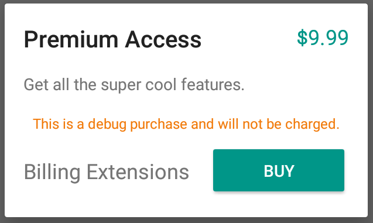

# BillingX: Billing Extensions

<table>
  <tr>
    <td>
        <h3>DEPRECATED</h3>
        BillingX is deprecated. No more development will be taking place. Thanks for all your support!
    </td>
  </tr>
</table>
<br/><br/>

Extensions for the [Play Billing Library](https://developer.android.com/google/play/billing/billing_java_kotlin)
to allow fake purchases and transaction management in debug builds.



BillingX uses a local store for sku and purchase information, allowing you to use a `BillingClient`
implementation to make purchases and query information without needing to connect to the Play Store.

If you interact with the Play Store using anything other than the Play Billing Library then BillingX
isn't for you.  You should check out [Register](https://github.com/NYTimes/Register).

> BillingX is currently in super early release.  It's being used in production apps (debug
 variants), but isn't yet complete.

## Todo

* Implement IAB consumption.
* Add config activity to manage inventory.
* Add support for specifying supported feature return types. 

## Usage

Simply inject the `DebugBillingClient` instead of the standard `BillingClient` from the support
library.  Then you can continue to use the `BillingClient` as you normally would.

If you're not using a dependency injection framework like
[Dagger](https://google.github.io/dagger/), you can create a simple factory to get the appropriate
instance. 

In `src/release/java`:

```kotlin
object BillingClientFactory {
  fun createBillingClient(activity: Activity, updateListener: PurchasesUpdatedListener): BillingClient {
    return BillingClient
        .newBuilder(activity)
        .enablePendingPurchases()
        .setListener(updateListener)
        .build()
  }
}
```

In `src/debug/java`:

```kotlin
object BillingClientFactory {
  fun createBillingClient(activity: Activity, updateListener: PurchasesUpdatedListener): BillingClient {
    return DebugBillingClient(
        activity = activity,
        backgroundExecutor = Executors.diskIO,
        purchasesUpdatedListener = updateListener
    )
  }
}
```

## Custom BillingStore

By default, BillingX uses a built in `BillingStore` backed by shared preferences. You can supply
your own `BillingStore` to the `DebugBillingClient` constructor if you'd prefer to store your
inventory and purchase information elsewhere, like an SQLite database or web service. 

```kotlin
object BillingClientFactory {
  fun createBillingClient(activity: Activity, updateListener: PurchasesUpdatedListener): BillingClient {
    return DebugBillingClient(
        activity = activity,
        backgroundExecutor = Executors.diskIO,
        purchasesUpdatedListener = updateListener,
        billingStore = MyBillingStore()
    )
  }
}
```

You simply need to create an implementation of the [BillingStore](library/src/main/java/com/pixite/android/billingx/BillingStore.kt)
abstract class in your custom class.  Note that threading is taken care of in the
`DebugBillingClient` so all methods implemented in your custom `BillingStore` can be synchronous.

### Initializing the Inventory

When using the default BillingStore, you must first initialize the inventory before you can make
purchases or view products.
  
The `BillingStore` abstract class includes a companion function to retrieve the default store. From
there you can update the products and purchases.  

```kotlin
fun setupPurchases(activity: Activity) {
  BillingStore.defaultStore(activity)
      .clearProducts()
      .addProduct(
          SkuDetailsBuilder(sku = "com.myapp.weekly", type = BillingClient.SkuType.SUBS,
              price = "$3.99", priceAmountMicros = 3990000, priceCurrencyCode = "USD",
              title = "Weekly", description = "Weekly Premium Subscription",
              subscriptionPeriod = "P1W", freeTrialPeriod = "P1W").build()
      )
      .addProduct(
          SkuDetailsBuilder(sku = "com.myapp.monthly", type = BillingClient.SkuType.SUBS,
              price = "$8.99", priceAmountMicros = 8990000, priceCurrencyCode = "USD",
              title = "Monthly", description = "Monthly Premium Subscription",
              subscriptionPeriod = "P1W", freeTrialPeriod = "P1W").build()
      )
      .addProduct(
          SkuDetailsBuilder(sku = "com.myapp.yearly", type = BillingClient.SkuType.SUBS,
              price = "$59.99", priceAmountMicros = 59990000, priceCurrencyCode = "USD",
              title = "Yearly", description = "Yearly Premium Subscription",
              subscriptionPeriod = "P1W", freeTrialPeriod = "P1W").build()
      )
}
```

## Download

Import the billingx library only into your debug builds and use the standard billing support library
in your release builds. 

```groovy
debugImplementation 'com.pixiteapps.billingx:billingx:0.9.0'
releaseImplementation 'com.android.billingclient:billing:4.0.0'
```

## License

```
Copyright 2018 Pixite LLC.

Licensed under the Apache License, Version 2.0 (the "License");
you may not use this file except in compliance with the License.
You may obtain a copy of the License at

   http://www.apache.org/licenses/LICENSE-2.0

Unless required by applicable law or agreed to in writing, software
distributed under the License is distributed on an "AS IS" BASIS,
WITHOUT WARRANTIES OR CONDITIONS OF ANY KIND, either express or implied.
See the License for the specific language governing permissions and
limitations under the License.
```
